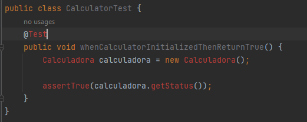
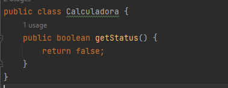
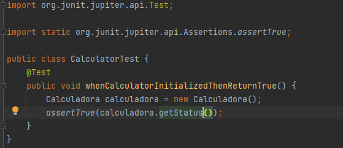
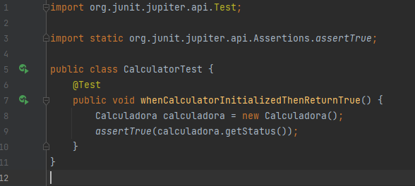

# RGR
**Producto:** Una clase de calculadora simple. 

**Requisito 1:** El estado de la calculadora es verdadero cuando se inicializa correctamente. 

Escribe la primera prueba en la clase `CalculatorTest`.

```
@Test
public void whenCalculatorInitializedThenReturnTrue() {
	Calculadora calculadora = new Calculadora();   	 
	assertTrue(calculadora.getStatus());
}
``` 
Evidencia:



Importamos : 

- import org.junit.jupiter.api.Test; Para @Test

- import static org.junit.jupiter.api.Assertions.assertTrue; Para assertTrue( ... )

- Control+ Enter para crear  la clase Calculadora



Finalmente tendriamos  :



Prueba no pasa tenemos que retornar True

```
public class Calculadora {
    public boolean getStatus() {
        return false;
    }
}
``` 
La prueba pasa :




Ahora lo refactorizamos añadiendo un atributo que guarde el estado
```
private boolean status;

public Calculadora() {
	this.status = true;
}

public boolean getStatus() {
	return status;
}
``` 

